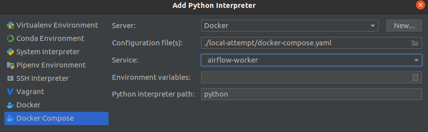

This is a test environment for docker compose, dbt, and airflow.

# Prerequisites
* 4GB RAM
* 2 CPU kernels

# Initializing Environment
Everything described is only needs for the first time.

## avoid sudo
If you have to use `sudo` for your docker commands, you should  open a shell and run:
```bash
sudo usermod -aG docker $USER
```
And then logout then login again.
Now you can run docker commands without `sudo`.
This also seems to be needed to run docker compose.

## initialize airflow environment
The following instructions are based on 
https://airflow.apache.org/docs/apache-airflow/stable/start/docker.html

On Linux, open a shell and run:
```bash
AIRFLOW_DIRECTORY=/var/airflow

sudo mkdir $AIRFLOW_DIRECTORY
sudo chown $(id -u):$(id -g) $AIRFLOW_DIRECTORY

mkdir $AIRFLOW_DIRECTORY/dags
mkdir $AIRFLOW_DIRECTORY/logs
mkdir $AIRFLOW_DIRECTORY/plugins

cd local-attempt
echo -e "AIRFLOW_UID=$(id -u)\nAIRFLOW_GID=0" > .env
```

If you are running airflow `2.0.1`, run:
```bash
cd local-attempt
docker build -f ./Dockerfile.airflow2.0.1.fix -t apache/airflow:2.0.1 .
```
See https://github.com/apache/airflow/issues/14266#issuecomment-796923376

Then, run:
```bash
cd local-attempt
docker-compose up airflow-init
```

## configure PyCharm

### configure docker compose Python interpreter
See https://www.jetbrains.com/help/pycharm/using-docker-compose-as-a-remote-interpreter.html#configuring-docker



### add a run configuration for our Python app
See https://www.jetbrains.com/help/pycharm/creating-and-editing-run-debug-configurations.html#createExplicitly


# Use Environment

## start airflow environment

### PyCharm (recommended)
Start the services (containers) by clicking on the green arrows in the `docker-compose.yaml`.

### CLI (alternative)
On Linux, open a shell and run:
```bash
cd local-attempt
docker-compose up
```
Press `CTRL+C` to stop the containers.
Or, from another shell:
```bash
cd local-attempt
docker-compose stop
```

## start our Python app

### PyCharm (recommended)
Click the green arrow next to our `app` "Run Configuration".
